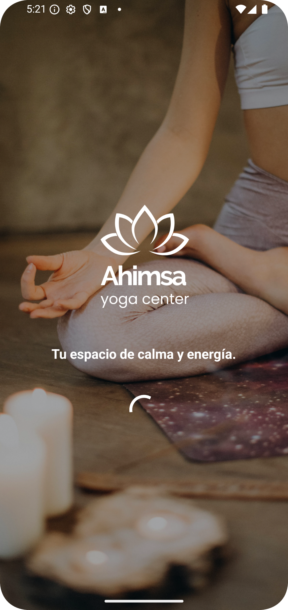
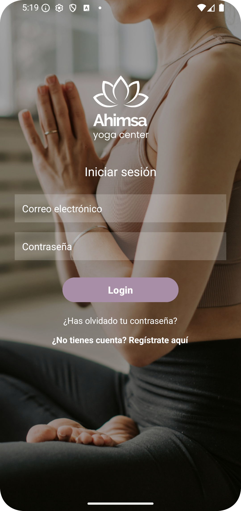
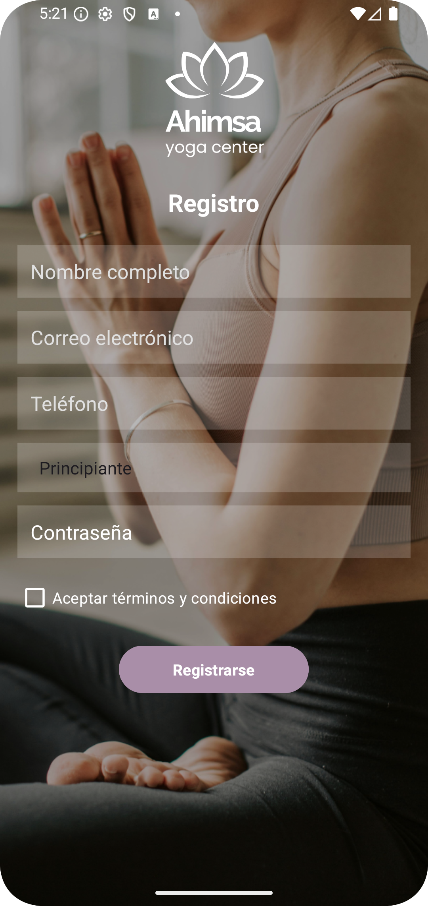
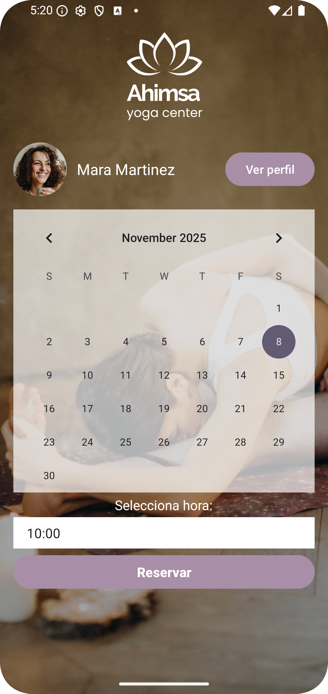
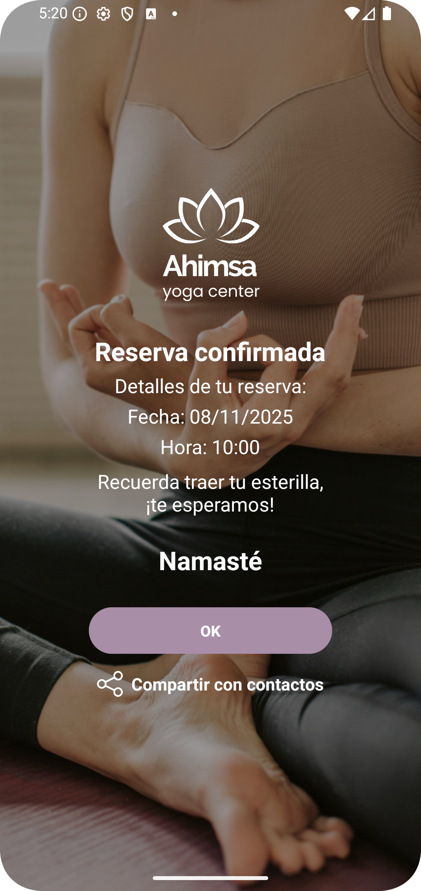
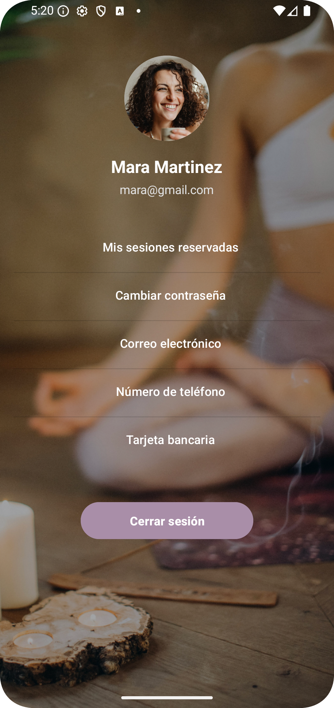

# Ahimsa | Yoga Center - App 🧘‍♀️  

**Aplicación Android nativa desarrollada en Kotlin que simula la gestión de reservas de sesiones de yoga.**
Esta aplicación permite a los usuarios de un centro de Yoga registrarse, iniciar sesión y reservar sesiones a través de un calendario interactivo.  
La app implementa almacenamiento local mediante **SharedPreferences**, validación de datos y un flujo de navegación simple e intuitivo.

## ⚙️ Tecnologías y herramientas  
- **Lenguaje:** Kotlin  
- **IDE:** Android Studio  
- **SDK:** Android 14 (API 34)  
- **Persistencia:** SharedPreferences  
- **Diseño de interfaz:** XML  
- **Compatibilidad:** Android 8.0 (API 26) o superior

## 📸 Interfaz de las pantallas

<table>
  <tr>
    <td align="center">
      <br>
      SplashActivity
    </td>
    <td align="center">
      <br>
      Login
    </td>
    <td align="center">
      <br>
      Registro
    </td>
  </tr>
  </table>
  
  <table>
    <tr>
    <td align="center">
      <br>
      Calendario
    </td>
    <td align="center">
      <br>
      Confirmación
    </td>
    <td align="center">
      <br>
      Perfil
    </td>
  </tr>
</table>

| Pantalla             | Descripción                                          |
| -------------------- | ---------------------------------------------------- |
| SplashActivity       | Pantalla inicial que redirige al login o calendario. |
| LoginActivity        | Inicio de sesión del usuario.                        |
| RegistroActivity     | Registro de nuevos usuarios.                         |
| CalendarioActivity   | Selección de fecha y hora de reserva.                |
| ConfirmacionActivity | Confirmación y opción de compartir.                  |
| PerfilActivity       | Datos del usuario y cierre de sesión.                |

## 🧩 Estructura del proyecto  
El proyecto está organizado por paquetes según la responsabilidad de cada componente:

```

com.example.ahimsa
│
├── model          # Entidades y clases de datos
│   ├── Usuario.kt
│   └── Reserva.kt
│
├── storage        # Persistencia y gestión de SharedPreferences
│   └── PrefManager.kt
│
└── ui             # Interfaz de usuario (Activities)
├── SplashActivity.kt
├── LoginActivity.kt
├── RegistroActivity.kt
├── CalendarioActivity.kt
├── ConfirmacionActivity.kt
└── PerfilActivity.kt

````

## 🔄 Flujo de navegación  
1. **SplashActivity:** determina si hay sesión iniciada.  
2. **LoginActivity:** permite iniciar sesión o ir al registro.  
3. **RegistroActivity:** guarda los datos del usuario en `SharedPreferences`.  
4. **CalendarioActivity:** selecciona fecha y hora de reserva.  
5. **ConfirmacionActivity:** muestra los datos de la reserva y opción de compartir.  
6. **PerfilActivity:** muestra la información del usuario y permite cerrar sesión.

## 🧠 Funcionalidades principales  
- Registro y autenticación local.  
- Almacenamiento persistente con `SharedPreferences`.  
- Validación de datos de entrada.  
- Permiso de acceso a contactos para compartir reservas.  
- Flujo de navegación completo entre pantallas.  

## 🔐 Permisos  
El proyecto requiere el permiso de lectura de contactos en el manifiesto (AndroidManifest.xml):  

```xml
<uses-permission android:name="android.permission.READ_CONTACTS" />
````

## 👩‍💻 Autora

**Tamara Martínez Vargas**

Proyecto para la asignatura **Programación Multimedia y Dispositivos Móviles** del **2º curso** del **Grado Superior en Desarrollo de Aplicaciones Multiplataforma**
